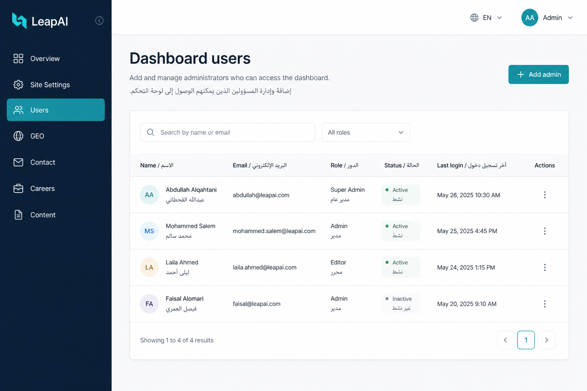
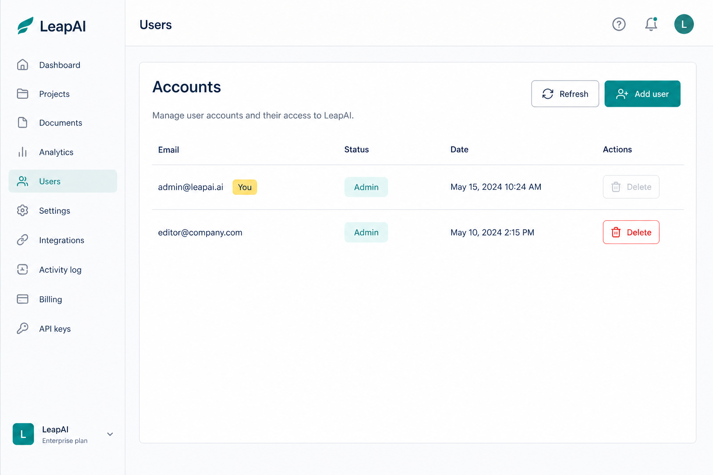
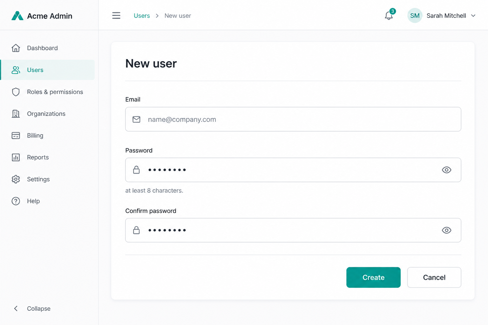
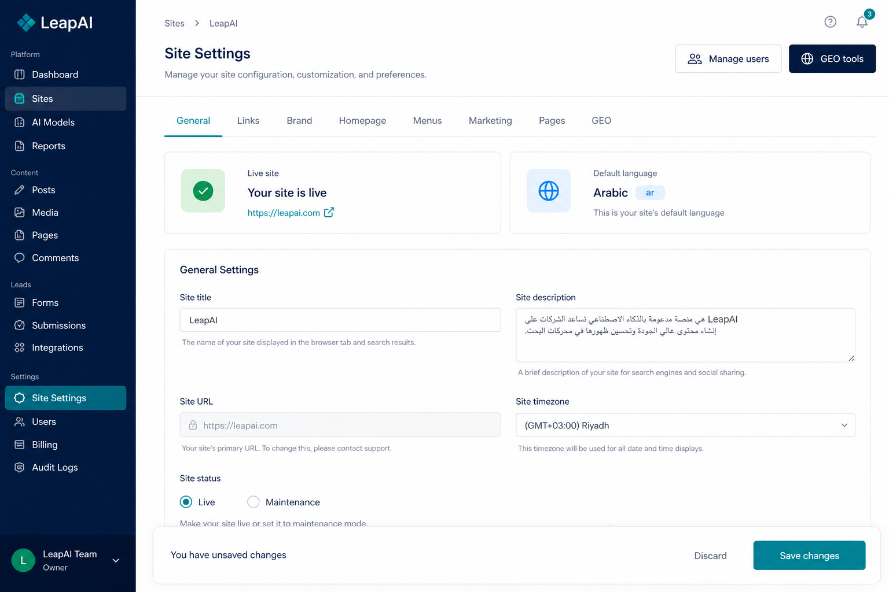

# How to Manage Dashboard Users (Simple Guide)

> **No programming needed.** Add or remove people who can log in to the LeapAI admin dashboard.

Related guide: [How to Use the Admin Dashboard](./HOW-TO-USE-ADMIN.md)

---

## What this page does

Every person who can open `/dashboard` must have an **admin account** (email + password).

From **Dashboard → Users** you can:

- See all admin accounts
- **Add** a new admin (full access to settings, content, careers, contact, GEO)
- **Delete** an admin you no longer need

There are **no separate roles** — every user has full dashboard access.

| Field | Value |
|-------|--------|
| **URL** | `https://leapai.ai/dashboard/users` |
| **Also from** | Settings → **Manage users** |

Local: http://localhost:3000/dashboard/users

---

## Open the Users page

1. Log in at `/dashboard/login`
2. In the left sidebar, click **Users** (or **مستخدمو لوحة التحكم** in Arabic)



You can also open it from **Settings** using the **Manage users** button at the top.

---

## See the list of admins

The main table shows every account that can sign in:

| Column | Meaning |
|--------|---------|
| **Email** | Login email |
| **Status** | Always Admin (full access) |
| **Date** | When the account was created |
| **Actions** | Delete button |

Your own account shows a **You** badge.



Use **Refresh** if the list looks out of date.

---

## Add a new user

1. Click **Add user**
2. Fill the form:
   - **Email** — must be a valid email (used to log in)
   - **Password** — at least **8 characters**
   - **Confirm password** — must match
3. Click **Create**



The new person can sign in immediately at `/dashboard/login` with that email and password. They get the **same full access** you have (settings, content, careers inbox, contact inbox, GEO, and users).

### Common errors

| Message | What to do |
|---------|------------|
| Passwords do not match | Type the same password in both fields |
| Password too short | Use 8 or more characters |
| Email already exists | That email is already an admin — use another email, or delete the old account first |

---

## Delete a user

1. Find the row in the table
2. Click **Delete**
3. Confirm in the browser dialog

### Rules (for safety)

| Rule | Why |
|------|-----|
| You **cannot** delete yourself | Prevents locking yourself out by mistake |
| You **cannot** delete the **last** admin | Always keeps at least one account that can log in |

---

## Settings tabs (quick reminder)

Site Settings are organized into tabs so you do not scroll one long page:

**General · Links · Brand · Homepage · Menus · Marketing · Pages · GEO**



From Settings you can jump to:

- **Manage users** → `/dashboard/users`
- **GEO tools** → `/dashboard/geo`

Remember to click **Save** at the bottom after editing Settings.

---

## How it works (simple flow)

```text
Admin logs in
    → Opens Dashboard → Users
    → Adds email + password
    → Backend stores password securely (hashed)
    → New admin logs in at /dashboard/login
    → Same full dashboard access
```

---

## Quick map

| I want to… | Go to… |
|------------|--------|
| Add someone to the dashboard | Users → Add user |
| Remove someone’s access | Users → Delete |
| Change site content / logo / menus | Settings (tabs) |
| Check AI crawler files | GEO |
| Read job applications | Careers |
| Read contact form messages | Contact |

---

## Tips

- Share the login URL, email, and a strong password **privately** (not in a public chat)
- Ask the new user to change the password after first login if your process requires it (today: an admin must delete and recreate the account to reset a password)
- Use **Arabic / English** toggle in the dashboard header — Users and Settings are translated

---

*Last updated: August 2026*
